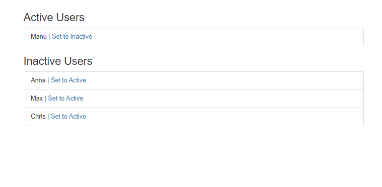
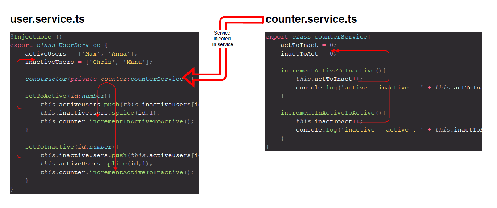
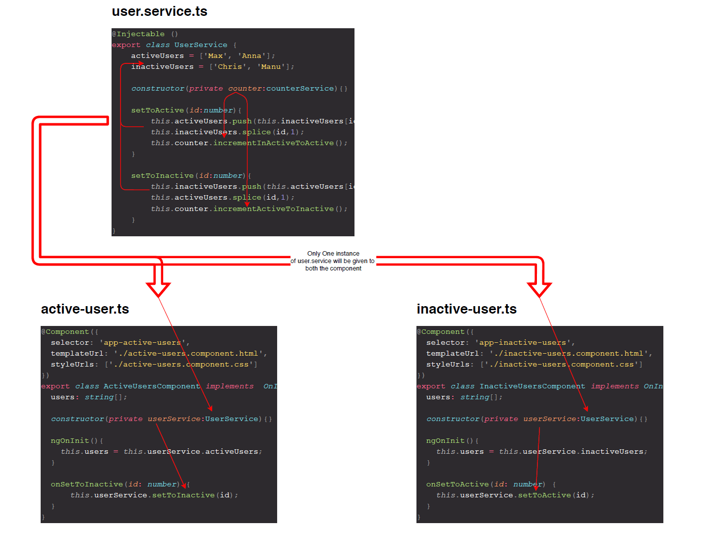

# Service Assignment

## Assignment Requirement

1. Create a page which have two main sections
2. section 1: active users
3. section 2 : inactive users
4. There should be at least 3 users in total
5. each user should displayed by the name and accompanied with the button
6. The button of each user should either be shown as  ```set to active``` or ```set to inactive```
7. The text on button should change according to the location of user
   1. If user is in active mode then the text of button should be ```set to inactive```
   2. If user is in inactive mode then the text of button should be ```set to active```
8. When ```set to active``` button of certain user is pressed, then the user should be moved from ```inactive users section ``` to the ```active users section``` and same with other way around
9. By default all the users should be inactive and shown in ```inactive users section```
10. Please use services to achieve the implementation



## Project Structure

~~~typescript
 src
  └── app
      ├── active-users
      │   ├── active-users.component.ts
      │   ├── active-users.component.html
      │   └── active-users.component.css
      ├── inactive-users
      │   ├── inactive-users.component.ts
      │   ├── inactive-users.component.html
      │   └── inactive-users.component.css
      ├── app.component.ts
      ├── app.component.html
      ├── app.component.css
      ├── app.module.ts
      ├── counter.service.ts
      └── users.service.ts
~~~

## Service to Service Injection



## Service to Component Injection

